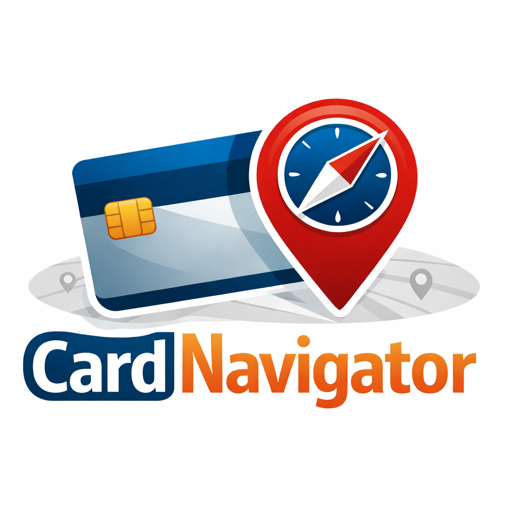

<p align="center"></p>

[](https://github.com/franc6/cardnavigator)
[](https://app.codecov.io/gh/franc6/cardnavigator/branch/main)

[](https://opensource.org/licenses/MIT)

## About

CardNavigator recommends the best credit card to use at nearby merchants. It fetches businesses around your current location using the **Google Places API**, maps each merchant category to a user-defined friendly name, and ranks your configured cards by cash-back percentage — accounting for foreign transaction fees when you're outside the US.

## Features

- **Nearby merchant lookup** — searches businesses around your current location via the Google Places API (New)
- **Card ranking** — ranks your cards by effective cashback percentage for each merchant category
- **Category mapping** — map Google Place types to your own friendly names (Grocery, Gas, Dining, etc.)
- **Foreign transaction fee awareness** — automatically adjusts rankings when you're outside the US
- **Passkey authentication** — WebAuthn/passkey login with optional email/password fallback

## Prerequisites

- PHP 8.4+
- Composer
- Node.js 20+
- SQLite
- A Google Maps API key with the **Places API (New)** enabled

### PHP extensions

Required: `pdo_sqlite`, `mbstring`, `openssl`, `tokenizer`, `xml`, `ctype`, `fileinfo`, `curl`, `gd`.

Optional: `imagick` (with libheif support) — enables HEIC/HEIF uploads on the Cards page. Without it the app still accepts PNG, JPEG, WEBP, and GIF.

## Local Setup

```bash
composer run setup
```

This installs dependencies, runs database migrations, builds the frontend assets, and generates an `.env` file. Edit the generated `.env` and fill in the settings below.

### Configuration

| Setting | Required? | What it is and where to get it |
|---------|-----------|-------------------------------|
| `WEBAUTHN_ID` | Required | The HTTPS origin of your deployment, e.g. `https://cards.example.com`. Used by WebAuthn as the relying-party identifier; passkey registration and sign-in fail if it doesn't match the URL users visit. |
| `GOOGLE_MAPS_API_KEY` | Required | A Google Cloud API key with the **Places API (New)** enabled. Used to look up nearby merchants. Create one at [Google Cloud Console → APIs & Services → Credentials](https://console.cloud.google.com/apis/credentials), then enable the Places API (New) for the same project. |
| `GOOGLE_MAPS_CACHE_TTL` | Optional | How long (in minutes) to cache Places API responses for a given location. Defaults to `20`, which is chosen so the Places API free tier remains free. |

`APP_KEY` is generated automatically by `composer run setup` and does not need to be edited by hand.

## First User

There is no web registration or default account. Create the first user from the command line:

```bash
php artisan user:create --admin
```

See [docs/deployment.md](docs/deployment.md) for full deployment and first-user setup instructions.

## Tech Stack

- **PHP 8.4 / Laravel 13** — backend and routing
- **SQLite** — zero-config database
- **Alpine.js + Tailwind CSS** — interactive UI
- **Vite** — frontend asset bundling
- **WebAuthn** — passkey-based authentication

## Deployment

See [docs/deployment.md](docs/deployment.md) for instructions on deploying via **cPanel** or **SSH**, including how to configure repository secrets and what happens on first deploy.

---

[Contributing](CONTRIBUTING.md) · [Security](.github/SECURITY.md) · [License](LICENSE) · [API Docs](https://franc6.github.io/cardnavigator/)
